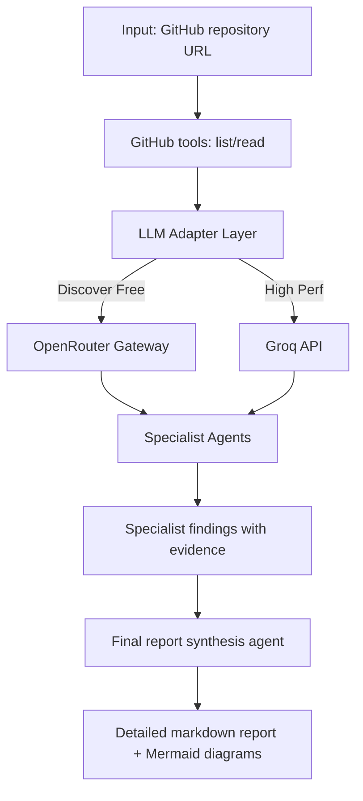
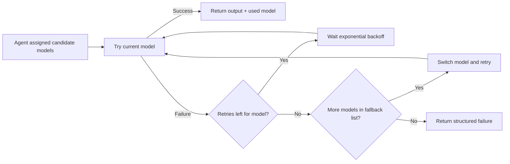
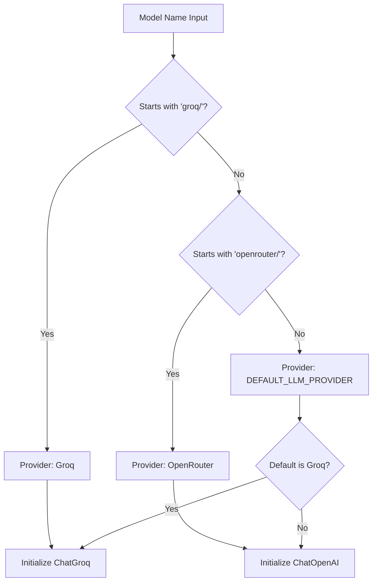

# Architecture Decision Record (ADR): Multi-Agent Architecture Reviewer

## 1. Context and Problem Statement
Single-agent architecture reviews were too broad, less explainable, and sensitive to free-tier model instability. We needed:
- deeper, domain-specific analysis across architecture quality dimensions
- robust operation on free models despite transient provider failures
- detailed, evidence-based reports with implementation-ready recommendations

## 2. Decisions

### 2.1 Multi-Agent Specialist Topology
**Decision:** Transition from a monolithic analysis to a multi-agent system, eventually stabilizing at 6 core specialist agents plus a final synthesizer.

**Rationale:** Domain-specialist prompts improve analysis depth. While we initially started with 12 agents, we consolidated to 6 to reduce API call volume and mitigate free-tier rate limiting.

### 2.7 Agent Consolidation for Resilience (April 2026)
**Decision:** Consolidate 12 specialized agents into 6 broader core agents.
- **Tech & Architecture** (Merged Fingerprint + Directory + Migration)
- **Security & Privacy** (Stable)
- **Design & Maintainability** (Merged Principles + Patterns + Maintainability)
- **Code Quality & Typing** (Merged Quality + Typing)
- **Performance & Efficiency** (Merged Structures + Performance)
- **Testing & QA** (Stable)

**Rationale:** 
1. **Rate Limit Resilience:** Reduces the total number of API cycles per run by 50%, significantly decreasing the chance of transient failures on OpenRouter free-tier.
2. **Context Enrichment:** Broader agents can see cross-cutting concerns (e.g., how typing strictness impacts overall code quality) that were previously siloed.

**Trade-off:** Slightly longer individual agent prompts, but significantly better overall system reliability.

### 2.2 Free-Model Strategy with Dynamic Discovery
**Decision:** Dynamically fetch OpenRouter model catalog and pick per-agent best free models from curated preferences.

**Rationale:** Free-model availability changes over time; static single-model assumptions are brittle.

**Trade-off:** Slight startup overhead for model discovery, improved robustness across runtime sessions.

### 2.3 Retry, Exponential Backoff, and Fallback Chain
**Decision:** Add retry attempts per model with exponential backoff; fallback to alternate free models if retries fail.

**Rationale:** Free endpoints often return transient errors (rate limits, timeouts, occasional provider failures).

**Trade-off:** Increased latency in failure scenarios, much higher completion probability.

### 2.4 Parallel Specialist Execution
**Decision:** Run specialist agents concurrently using configurable worker count.

**Rationale:** Reduces end-to-end report latency for multi-agent runs.

**Trade-off:** Higher burst traffic can increase transient failures, mitigated by retries/fallback and worker tuning.

### 2.5 Operator-Controlled Runtime Presets
**Decision:** Add **Fast**, **Reliable**, and **Custom** execution modes in UI.

**Rationale:** Different usage contexts require different trade-offs between speed and stability.

**Trade-off:** Slightly more UI complexity, better operator control and predictability.

### 2.8 Modular Architecture and Code Organization (April 2026)
**Decision:** Refactor the codebase from a monolithic file into a modular structure organized by responsibility:
- `agents/`: Implementation and prompts for specialist and synthesizer agents.
- `tools/`: External service connectors (GitHub API).
- `memory/`: Run-to-run state and context persistence.
- `schemas/`: Pydantic models for structured data and type safety.
- `graphs/`: Orchestration logic using LangGraph for future pipeline flexibility.
- `config/`: Centralized settings, constants, and model preferences.
- `utils/`: Shared rendering and model selection logic.
- `ui/`: Streamlit components and user interface orchestration.

**Rationale:** Improves maintainability, testability, and scalability. As the number of agents and features grow, a single file (`app.py`) becomes impossible to manage.

**Trade-off:** Slightly more initial complexity in managing imports and file structure, significantly better long-term velocity.

### 2.9 LLM Adapter Layer for Multi-Provider Support (April 2026)
**Decision:** Implement an adapter factory (`src/utils/llm_factory.py`) to abstract the underlying LLM provider (OpenRouter or Groq).
- **Prefix Isolation**: Use `groq/` or `openrouter/` prefixes in model names to route to specific providers.
- **Unified Interface**: Return a standard LangChain BaseChatModel regardless of the backend.

**Rationale:** 
1. **Low Latency**: Allows using Groq for near-instant inference when specific high-performance models are needed.
2. **Diversity**: Retains access to OpenRouter's massive catalog of free models.
3. **Future-Proofing**: Makes it trivial to add new providers (Anthropic, Gemini, etc.) without touching agent code.

**Trade-off:** Requires managing multiple API keys, but provides superior model flexibility and speed.

## 3. System Flow

### 3.1 High-Level Pipeline

### 3.2 Reliability Flow

### 3.4 LLM Adapter Routing Logic

### 3.3 Runtime Modes
- **Fast:** high concurrency, low retries, minimal backoff.
- **Reliable:** lower concurrency, higher retries, stronger backoff.
- **Custom:** user-defined workers/retries/backoff values.

## 4. Tooling and Constraints
- GitHub ingestion via:
  - `list_repo_files` (up to configured file-list cap)
  - `read_specific_file` (file-content cap to control token usage)
- Authenticated GitHub requests use `GITHUB_TOKEN` when available to improve API limits.
- Streamlit UI provides run controls, progress feedback, per-agent model visibility, and final report display.

## 5. Validation Strategy
- Integration-oriented checks via `pytest`:
  - repository tree retrieval
  - file content retrieval
  - agent initialization and invocation loop
- Functional contract approach is retained due to LLM non-determinism.

## 6. Consequences
### Positive
- Better depth and traceability of architectural findings.
- Stronger completion reliability on free-model infrastructure.
- Faster analysis when parallel mode is enabled.

### Negative
- Higher complexity in orchestration and runtime tuning.
- More external dependencies (OpenRouter catalog behavior and free-model health).

## 7. Future Enhancements
- Cache repository tree and file reads within a single run to reduce repeated API calls.
- Add optional SARIF/JSON export for CI integration.
- Add confidence scoring normalization across specialists.