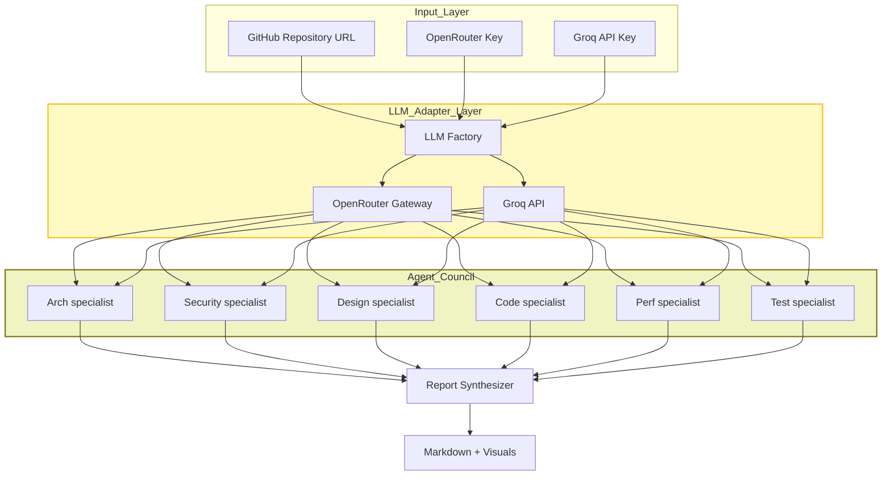
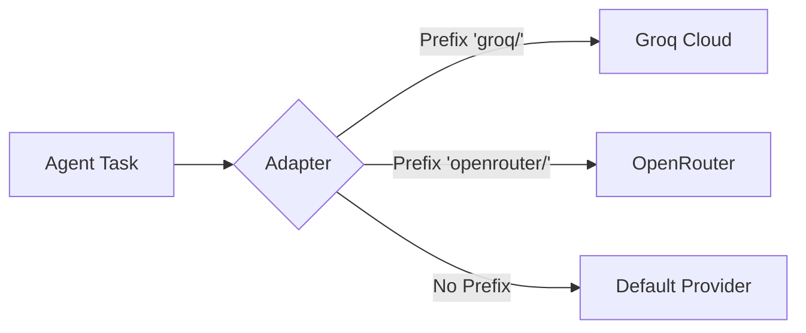

# 🏗️ ArchGuard AI: Agentic Architecture Assistant

**A sophisticated multi-agent system designed to perform deep repository analysis, security auditing, and architectural health assessments using state-of-the-art LLMs.**

---

## 🌟 Overview

ArchGuard AI is a powerful, production-ready tool that transforms how engineering teams review codebases. By orchestrating a "Council of Specialists," it goes beyond simple linting to provide deep, evidence-based insights into tech stack maturity, security posture, design integrity, and performance efficiency.

Built with **LangGraph**, it utilizes a robust **ReAct (Reasoning and Acting)** pattern to allow agents to interact directly with your GitHub repository, fetch specific files, and build a comprehensive understanding of the architecture before synthesizing a final, prioritized engineering roadmap.

---

## 🚀 Key Features

- **Council of Specialists**: 6 domain-specific agents focused on Architecture, Security, Design, Code Quality, Performance, and Testing.
- **Evidence-Based Findings**: Every finding is backed by direct evidence fetched from the repository using automated tools.
- **LLM Adapter Layer**: Unified interface for seamlessly switching between **OpenRouter** and **Groq**.
- **Multi-Model Intelligence**: Dynamically selects best free models (Gemma, Qwen, Llama) or high-performance Groq models.
- **Runtime Resilience**: Intelligent retries, exponential backoff, and model fallback chains.
- **Interactive Visualizations**: Embedded Mermaid.js diagrams for architecture and risk hotspots.
- **Flexible Execution**: Choose between **Fast**, **Reliable**, or **Custom** modes.
- **CLI & UI Support**: Professional Streamlit web interface and a robust CLI for CI/CD.

---

## 🛠️ Tech Stack

| Layer | Technology |
| :--- | :--- |
| **User Interface** | [Streamlit](https://streamlit.io/) |
| **Orchestration** | [LangGraph](https://github.com/langchain-ai/langgraph) & [LangChain](https://www.langchain.com/) |
| **Model Gateway** | [OpenRouter](https://openrouter.ai/) & [Groq](https://groq.com/) |
| **Version Control** | [GitHub REST API v3](https://docs.github.com/en/rest) |
| **Logic/Runtime** | Python 3.10+ |
| **Visualization** | [Mermaid.js](https://mermaid.js.org/) |
| **Testing** | [Pytest](https://pytest.org/) |

---

## 📐 System Architecture

### Multi-Agent Pipeline
The system utilizes a unified **LLM Adapter Layer** to route requests to either OpenRouter (for variety/free models) or Groq (for performance/low-latency).



---

## 🔄 Functional Flow

### 1. Ingestion & Routing
The process begins by parsing the GitHub URL and fetching the complete file tree. The **LLM Adapter Layer** then routes the request based on the selected model:
- **Groq**: Low-latency inference for compatible models.
- **OpenRouter**: Access to a broad catalog of free/paid models with built-in fallbacks.



### 2. Specialist Investigation (ReAct Pattern)
Each specialist agent follows a **Reasoning + Action** loop:
- **Observation**: Reviews the file tree to identify high-interest files (e.g., `package.json`, `settings.py`, `.env`).
- **Action**: Uses the `read_specific_file` tool to fetch source code.
- **Thinking**: Analyzes the evidence against domain-specific principles (SOLID, OWASP, etc.).
- **Scoring**: Assigns a numeric score (0-100) based on findings.

### 3. Resilience & Fallback
If a model fails due to rate limits (429) or provider outages, the system automatically:
1.  **Retries** with exponential backoff.
2.  **Switches** to the next best model in the fallback chain.
3.  **Parses** rate-limit reset headers to wait precisely long enough.

### 4. Synthesis & Visualization
The Report Synthesizer takes all specialist outputs and builds a cohesive narrative, including an executive summary and a **30/60/90 day roadmap**. It also generates Mermaid code which the UI renders into interactive SVGs.

---

## 📁 Project Structure

```text
.
├── src/
│   ├── agents/
│   │   ├── specialist.py       # ReAct specialist agent with retry & fallback
│   │   └── synthesizer.py      # Final report synthesizer agent
│   ├── config/
│   │   └── settings.py         # Centralised settings & model constants
│   ├── graphs/
│   │   └── reporter.py         # LangGraph state machine & ReporterState schema
│   ├── memory/
│   │   └── manager.py          # Streamlit session-state memory management
│   ├── schemas/
│   │   └── models.py           # Pydantic data models (AgentSpec, FinalReport…)
│   ├── tools/
│   │   └── github.py           # GitHub REST API helpers (file tree, content)
│   ├── ui/
│   │   └── components.py       # Sidebar, JSON export, download buttons
│   ├── utils/
│   │   ├── export.py           # Word (.docx) & PDF export utilities
│   │   ├── llm_factory.py      # Provider-agnostic LLM adapter (Groq / OpenRouter)
│   │   ├── models.py           # Free-model discovery & candidate selection
│   │   └── rendering.py        # Mermaid diagram renderer & enriched report display
│   ├── app.py                  # Main Streamlit Application & orchestration logic
│   ├── cli.py                  # Command-Line Interface for CI/CD pipelines
│   └── mermaid.min.js          # Bundled Mermaid.js for offline rendering
├── tests/
│   ├── unit/
│   │   ├── test_export.py          # Export (docx / pdf) utilities
│   │   ├── test_github.py          # GitHub tool functions
│   │   ├── test_llm_factory.py     # LLM provider routing
│   │   ├── test_memory_manager.py  # Session-state memory manager
│   │   ├── test_models.py          # Free-model discovery & selection
│   │   ├── test_rendering.py       # Mermaid & enriched report rendering
│   │   ├── test_reporter.py        # LangGraph reporter graph
│   │   ├── test_schemas.py         # Pydantic schema validation
│   │   ├── test_specialist.py      # Specialist agent + retry logic
│   │   ├── test_synthesizer.py     # Synthesizer agent + retry logic
│   │   └── test_ui_components.py  # UI components (sidebar, JSON export)
│   └── e2e/
│       ├── test_cli_e2e.py         # CLI pipeline end-to-end tests
│       └── test_ui_e2e.py          # Streamlit UI end-to-end tests (AppTest)
├── docs/
│   └── ADR.md              # Architecture Decision Records
├── .env.example            # Environment variable template
├── requirements.txt        # Python dependencies
└── pytest.ini              # Pytest configuration & filter rules
```

### Key Components
- **`src/utils/llm_factory.py`**: Provider-agnostic LLM adapter — routes to Groq or OpenRouter based on model prefix.
- **`src/agents/specialist.py`**: ReAct agent with exponential backoff, rate-limit detection, and multi-model fallback chain.
- **`src/graphs/reporter.py`**: LangGraph `StateGraph` defining the orchestration pipeline state machine.
- **`src/ui/components.py`**: Reusable Streamlit sidebar, JSON export builder, and file download buttons.
- **`src/app.py`**: Full Streamlit dashboard — wires all components into the analysis workflow.
- **`src/cli.py`**: Headless CLI for automated repository analysis in CI/CD pipelines.

---

## 🛠️ Installation & Setup

### Prerequisites
- Python 3.10 or higher
- [OpenRouter API Key](https://openrouter.ai/keys)
- [GitHub Personal Access Token](https://github.com/settings/tokens) (Optional but recommended for higher rate limits)

### Step 1: Clone & Install
```bash
git clone <repository-url>
cd archguard-ai
pip install -r requirements.txt
```

### Step 2: Configure Environment
Copy the example environment file and fill in your keys:
```bash
cp .env.example .env
```

Edit `.env`:
```bash
OPENROUTER_API_KEY=your_openrouter_key
GROQ_API_KEY=your_groq_key
GITHUB_TOKEN=your_github_token
DEFAULT_LLM_PROVIDER=openrouter
```

### Step 3: Run the Dashboard
```bash
streamlit run src/app.py
```

---

## 📖 Usage Guide

1.  **Input**: Enter a public or private (if token provided) GitHub URL.
2.  **Select Mode**:
    - **Fast Mode**: For quick sweeps with high concurrency.
    - **Reliable Mode**: For stable analysis on congested free-tier models.
3.  **Run**: Click "Run Full Multi-Agent Analysis".
4.  **Analyze**: Watch progress in real-time as specialists report in.
5.  **Export**: Scroll to the bottom to download the detailed Markdown report or the raw JSON data.

---

## 🧪 Testing & Validation

ArchGuard AI ships a **comprehensive, multi-layer test suite** — 88 tests covering every module across unit, CLI E2E, and Streamlit UI E2E layers.

### Test Matrix

| Layer | File | Scope |
| :--- | :--- | :--- |
| **Unit** | `test_specialist.py` | Agent prompt building, retry logic, rate-limit backoff |
| **Unit** | `test_synthesizer.py` | Report synthesis, retry & fallback |
| **Unit** | `test_llm_factory.py` | Groq / OpenRouter routing by model prefix |
| **Unit** | `test_models.py` | Free-model discovery, candidate ranking, provider selection |
| **Unit** | `test_github.py` | URL parsing, file tree fetching, base64 decoding |
| **Unit** | `test_memory_manager.py` | Session-state init, context building, memory capping |
| **Unit** | `test_rendering.py` | Mermaid local/CDN rendering, enriched report display |
| **Unit** | `test_reporter.py` | LangGraph `StateGraph` compilation |
| **Unit** | `test_schemas.py` | Pydantic model validation (`AgentSpec`, `FinalReport`, …) |
| **Unit** | `test_export.py` | Word & PDF generation, character sanitisation |
| **Unit** | `test_ui_components.py` | `build_json_export`, sidebar state, export downloads |
| **E2E CLI** | `test_cli_e2e.py` | Full pipeline: memory load/save, analysis, file outputs |
| **E2E UI** | `test_ui_e2e.py` | Streamlit app: page load, sidebar config, input validation, report tabs, session state |

### Running Tests

```bash
# All unit tests only
python -m pytest tests/unit/ -v

# All CLI end-to-end tests
python -m pytest tests/e2e/test_cli_e2e.py -v

# All Streamlit UI end-to-end tests
python -m pytest tests/e2e/test_ui_e2e.py -v

# Full suite
python -m pytest tests/ -v
```

### Generating Coverage Reports

```bash
# Terminal summary (shows uncovered lines)
python -m pytest --cov=src --cov-report=term-missing tests/

# Interactive HTML report (open htmlcov/index.html)
python -m pytest --cov=src --cov-report=html tests/

# Run only fast tests, skip analysis flow
python -m pytest tests/ -k "not TestAnalysisFlow" -v
```

### UI E2E Testing — How It Works

Streamlit UI tests use **`streamlit.testing.v1.AppTest`** — Streamlit's first-party headless test runner. It simulates the full app execution without a browser, allowing interaction with widgets programmatically:

```python
from streamlit.testing.v1 import AppTest

at = AppTest.from_file("src/app.py").run()
assert len(at.exception) == 0                        # no crash on load
at.sidebar.radio[0].set_value("Groq").run()         # switch provider
assert at.sidebar.selectbox[0].options[0].startswith("groq/")  # correct models shown
```

Post-analysis UI is tested via `AppTest.from_function` with a self-contained page function, avoiding the `ThreadPoolExecutor` patching limitation inherent to `from_file` isolation.

---

## 📸 Visual Gallery

Explore the ArchGuard AI interface and its detailed reporting capabilities:

| **Main Dashboard** | **Analysis Progress** |
| :---: | :---: |
|  |  |
| *Enter GitHub URL and configure settings* | *Real-time specialist agent feedback* |

| **Architectural Visualizations** | **Risk Hotspots** |
| :---: | :---: |
|  |  |
| *Automated Mermaid diagrams of current state* | *Evidence-based risk mapping* |

---

## 👨‍💻 Contributing
We welcome contributions! Please see our [ADR.md](docs/ADR.md) to understand the design philosophy before submitting a PR.

## 📄 License
MIT License - Copyright (c) 2026 ArchGuard AI Team.